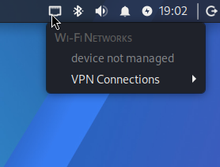
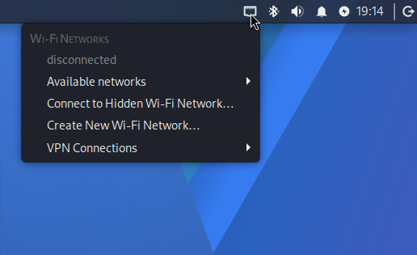

---
aliases:
  - What not to do and how to do things right notes
tags:
  - RaspberryPi
  - Linux
  - Networking
---

# Wireless LAN

## WiFi - Why you are doing it wrong

When flashing Kali linux OS for Raspberry Pi from Pi Imager, most of us choose the standard installation process with customization option which provides us the ability to set the hostname, user management and wifi connection capabilities.


If the clarification is not enough for the mentioned commands / utilities please refer to man pages.


This particular approach will end up creating a conflict with Kali Linux's NetworkManager, and we end up with a os without Wifi Capabilities, but other radio communications like Bluetooth and the physical network connection (Ethernet) will work fine



Upon closer inspection we will get to know the issue; its either the wpa_supplicant is not active or multiple instances are working trying to gain authority.

```bash
┌──(root㉿hackerlab)-[/home/hackerpi/Desktop/Wifi_Fix]
└─# nmcli device status
DEVICE  TYPE      STATE                   CONNECTION 
lo      loopback  connected (externally)  lo         
eth0    ethernet  unmanaged               --         
wlan0   wifi      unmanaged               --         

┌──(root㉿hackerlab)-[/home/hackerpi/Desktop/Wifi_Fix]
└─# nmcli -f GENERAL.STATE,GENERAL.REASON,GENERAL.NM-MANAGED device show wlan0
GENERAL.STATE:                          10 (unmanaged)
GENERAL.REASON:                         77 (The device is unmanaged via udev rule)
GENERAL.NM-MANAGED:                     no

┌──(root㉿hackerlab)-[/home/hackerpi/Desktop/Wifi_Fix]
└─# nmcli radio all
WIFI-HW  WIFI     WWAN-HW  WWAN    
enabled  enabled  missing  enabled 

┌──(root㉿hackerlab)-[/home/hackerpi/Desktop/Wifi_Fix]
└─# rfkill list
0: hci0: Bluetooth
	Soft blocked: no
	Hard blocked: no
1: phy0: Wireless LAN
	Soft blocked: no
	Hard blocked: no

┌──(root㉿hackerlab)-[/home/hackerpi/Desktop/Wifi_Fix]
└─# ps -ef | grep '[w]pa_supplicant'

┌──(root㉿hackerlab)-[/home/hackerpi/Desktop/Wifi_Fix]
└─# systemctl --type=service --all | grep -i wpa
  copy-user-wpasupplicant.service                       loaded    inactive dead    Copy user wpa_supplicant.conf
  netplan-wpa-wlan0.service                             loaded    inactive dead    WPA supplicant for netplan wlan0

┌──(root㉿hackerlab)-[/home/hackerpi/Desktop/Wifi_Fix]
└─# journalctl -b -u NetworkManager --no-pager | grep -iE 'wlan0|wifi|supplicant|wireless|firmware|brcm'
Mar 23 18:58:58 hackerlab NetworkManager[5806]: <info>  [1774272538.8125] manager[0x555622246ca0]: monitoring kernel firmware directory '/lib/firmware'.
Mar 23 18:58:58 hackerlab NetworkManager[5806]: <info>  [1774272538.8217] rfkill1: found Wi-Fi radio killswitch (at /sys/devices/platform/axi/1001100000.mmc/mmc_host/mmc1/mmc1:0001/mmc1:0001:1/ieee80211/phy0/rfkill1) (driver brcmfmac)
Mar 23 18:58:58 hackerlab NetworkManager[5806]: <info>  [1774272538.8569] Loaded device plugin: NMWifiFactory (/usr/lib/aarch64-linux-gnu/NetworkManager/1.56.1/libnm-device-plugin-wifi.so)
Mar 23 18:58:58 hackerlab NetworkManager[5806]: <info>  [1774272538.8852] device (wlan0): driver supports Access Point (AP) mode
Mar 23 18:58:58 hackerlab NetworkManager[5806]: <info>  [1774272538.8859] manager: (wlan0): new 802.11 Wi-Fi device (/org/freedesktop/NetworkManager/Devices/3)
```

From the above attached outputs, we can see the instance of wpa_supplicant is not initiated (output of `ps -ef | grep [w]pa_supplicant`). Also we can see there are no blocks on the the Wireless LAN from `rfkill list` command. Also we can see the service `netplan-wpa-wlan0.service` is loaded but inactive. Taking a close look at netplan folder, we can see a `*.yaml` file. 

```bash
┌──(root㉿hackerlab)-[/home/hackerpi/Desktop/Wifi_Fix]
└─# ls /etc/netplan/
50-cloud-init.yaml

┌──(root㉿hackerlab)-[/home/hackerpi/Desktop/Wifi_Fix]
└─# cat /etc/netplan/50-cloud-init.yaml 
network:
  version: 2
  ethernets:
    eth0:
      optional: true
      dhcp4: true
      dhcp6: true
  wifis:
    wlan0:
      optional: true
      dhcp4: true
      regulatory-domain: "IN"
      access-points:
        "<SSID_FROM_PIIMAGER>":
          auth:
            key-management: "psk"
            password: "<HASH_OF_PASSWORD_FOR_SSID>"

```

This is the **culprit** for hindering with Wi-Fi
### Solutions

* Easy way: Just **Skip Customization** and continue with flashing the SD Card / SSD. The default creds **kali:kali** will be applied with the hostname **kali-raspberrypi**


* Hard way: Manually overwriting the settings to disable the one set by the Pi Imager and kick starting the service

### Hardway - Manual Over-Ride (╥﹏╥)

Here while solving this we will take a look at Netplan, cloud-init, NetworkManager, wpa\_supplicant, interface ownership

The failure of initializing the wifi was **not** because of a blocked RF device / missing drivers. This can be confirmed with `rfkill` command


From Man page:&#x20;

```bash
rfkill - tool for enabling and disabling wireless devices
```


The output from rfkill command will let us know if the device is either hard / soft blocked. The NetworkManger's log will tell us exactly what the issue is, when I faced this issue I tried to look at the logs with the following command:

```bash
sudo journalctl -b -u NetworkManager --no-pager | grep -iE 'wlan0|wifi|supplicant|wireless|firmware|brcm'
```

From the output of journalctl we got the message "_Couldn't initialize supplicant interface, supplicant interface keeps failing._" Then by looking at the running processes of _wpa\_supplicant_, for the first time I got two instances of wpa\_supplicant running, and for the second time it was none. Either multiple instances or no instance at all. This behaviour can be confirmed with the following commands:

```bash
ps -ef | grep '[w]pa_supplicant' # either 2 instance or 0 instances as output
sudo systemctl --type=service --all | grep -i wpa 
```

This confirms that the actual failure was control-plane contention: two user-space networking stacks attempting to own the same wireless interface or none.

Remember when we provide the information about the WiFi on the Pi Imager, it asks for the WiFi SSID and the password, those details gets stored on the "_/etc/netplan/\*.yaml_" (typically, the name of the file will be 50-cloud-init.yaml). This file contains all WiFi definition. Netplan renders that definition via **networkd** path and launches an interface specific `wpa_supplicant` process using the _/run/netplan/wpa-wlan0.conf_, at the same time the desktop expected NetworkManger to manage `wlan0`. NetworkManager could see the device, but cannot claim the interface as its own supplication integration hinders it. Thus we get the WiFi not available message from the status bar.



Inspection Btw, the network devices can be inspected with the following command
```bash
nmcli device / nmcli device show 
```
We will use `nmcli` a lot


During this conflict, the output of nmcli will show either `unavailable` or `unmanaged` for `wlan0`

### What happens under the hood: Hardware Detection vs Network Ownership

Linux Wi-Fi operation is layered. A useful troubleshooting model is:

| Layer                 | Responsibility                                     | Evidence in this case                                                                       |
| --------------------- | -------------------------------------------------- | ------------------------------------------------------------------------------------------- |
| Firmware and hardware | The Pi's onboard radio and firmware respond        | `wlan0` existed; no hard RF block                                                           |
| Kernel driver         | Creates and controls the network interface         | `ip link` showed `wlan0`; the interface accepted an `UP` request                            |
| RF policy             | Allows or blocks transmission                      | `rfkill` showed hard block: no, soft block: no                                              |
| Supplicant            | Scans, authenticates, and associates with an AP    | Two supplicant control paths competed for `wlan0`                                           |
| Network manager       | Chooses profiles, DHCP, routes, DNS, and lifecycle | NetworkManager reported `unavailable` because it could not acquire the supplicant interface |
| Provisioning layer    | Generates persistent network configuration at boot | cloud-init generated Netplan YAML that recreated the conflict                               |

The boot process currently looks like the following:

```js
cloud-init
    |
    v
/etc/netplan/50-cloud-init.yaml
    |
    v
Netplan renderer: networkd
    |
    +--> systemd-networkd (IP configuration)
    |
    +--> netplan-wpa-wlan0.service
             |
             v
       wpa_supplicant -i wlan0 -c /run/netplan/wpa-wlan0.conf

Desktop session / Kali networking defaults
    |
    v
NetworkManager
    |
    v
D-Bus wpa_supplicant integration attempts to acquire wlan0
    |
    v
FAIL: interface already owned
```

The core problem relies in that Netplan is not a daemon that associates with Wi-Fi rather its a declarative generator. Based on the selected rendered, Netplan writes runtime configuration for a backend. Netplan's documentation explicitly notes that `systemd-networkd` does not natively implement Wi-Fi and therefore relies on `wpa_supplicant` when the `networkd` renderer handles wireless networking.

This problem is avoided in Raspberry Pi by one authoritative network manager which was well maintained by the team. Ubuntu avoids it by using Netplan as its declarative network layer but the renderer is selected to match the product. Ubuntu usually delegates networking tasks to NetworkManager. The architecture in Ubuntu will be as follows:

```js
Netplan declaration -> NetworkManager renderer -> NetworkManager -> wpa_supplicant
```

### Solution Steps

The issue can be resolved by restoring the single ownership of the interface, which can be achieved by the following steps:

* Stop cloud-init from regenerating network configuration
* Make Netplan delegate networking to `NetworkManager`
* Remove the stale per-interface Netplan WiFi Definition
* Allow NetworkManager's single D-Bus-managed `wpa_supplicant` instance to own `wlan0`


`nmcli` patch:

If you search the internet / ask AI for solution do not rely only on the 
```bash
sudo nmcli device set wlan0 managed yes
``` 
as this is only a temporary patch and when the Pi reboots we will be presented with the same issue and the command may not work for the second time


By now we know what the issue was and the steps to fix it, lets get it right away. The first thing we have to is to stop the cloud-init file and regenerate network configuration:

```bash
┌──(root㉿hackerlab)-[/home/hackerpi/Desktop/Wifi_Fix]
└─# ls -la /etc/cloud/cloud.cfg.d/
total 16
drwxr-xr-x 2 root root 4096 Jun 23  2026 .
drwxr-xr-x 5 root root 4096 Jun 23  2026 ..
-rw-r--r-- 1 root root 2071 Feb 28 04:21 05_logging.cfg
-rw-r--r-- 1 root root  167 Feb 28 04:21 README

┌──(root㉿hackerlab)-[/home/hackerpi/Desktop/Wifi_Fix]
└─# tee /etc/cloud/cloud.cfg.d/99-disable-network-config.cfg << "EOF_CLOUD"
> network: {config: disabled}
> EOF_CLOUD
network: {config: disabled}
```

Now that we have disabled, cloud-init for network, lets force the renderer to be NetworkManager.

```bash
┌──(root㉿hackerlab)-[/home/hackerpi/Desktop/Wifi_Fix]
└─# ls -la /etc/netplan
total 20
drwxr-xr-x   2 root root  4096 Mar 23 18:57 .
drwxr-xr-x 192 root root 12288 Mar 23 19:06 ..
-rw-------   1 root root   376 Mar 23 18:57 50-cloud-init.yaml

┌──(root㉿hackerlab)-[/home/hackerpi/Desktop/Wifi_Fix]
└─# mv /etc/netplan/50-cloud-init.yaml /etc/netplan/50-cloud-init.yaml.disabled

┌──(root㉿hackerlab)-[/home/hackerpi/Desktop/Wifi_Fix]
└─# tee /etc/netplan/01-network-manager.yaml >/dev/null << 'EOF_NETPLAN'
> network:
>   version: 2
>   renderer: NetworkManager
> EOF_NETPLAN

┌──(root㉿hackerlab)-[/home/hackerpi/Desktop/Wifi_Fix]
└─# cat /etc/netplan/01-network-manager.yaml 
network:
  version: 2
  renderer: NetworkManager

┌──(root㉿hackerlab)-[/home/hackerpi/Desktop/Wifi_Fix]
└─# chmod 600 /etc/netplan/01-network-manager.yaml

┌──(root㉿hackerlab)-[/home/hackerpi/Desktop/Wifi_Fix]
└─# ls /etc/netplan
01-network-manager.yaml  50-cloud-init.yaml.disabled
```

Now lets generate the plan and apply the changes.

```bash
┌──(root㉿hackerlab)-[/home/hackerpi/Desktop/Wifi_Fix]
└─# netplan generate

┌──(root㉿hackerlab)-[/home/hackerpi/Desktop/Wifi_Fix]
└─# netplan apply
```

(**Optional**) if the `ps -ef` from above shown the instance of `netplan-wpa-wlan0.service`, we have to stop them as well

```bash
# All of these will fail as we did not have any instance netplan-wpa-wlan0.service
┌──(root㉿hackerlab)-[/home/hackerpi/Desktop/Wifi_Fix]
└─# systemctl stop netplan-wpa-wlan0.service 2>/dev/null || true

┌──(root㉿hackerlab)-[/home/hackerpi/Desktop/Wifi_Fix]
└─# systemctl stop netplan-wpa-wlan0.service || true
Failed to stop netplan-wpa-wlan0.service: Unit netplan-wpa-wlan0.service not loaded.

┌──(root㉿hackerlab)-[/home/hackerpi/Desktop/Wifi_Fix]
└─# systemctl disable netplan-wpa-wlan0.service 2>/dev/null || true

┌──(root㉿hackerlab)-[/home/hackerpi/Desktop/Wifi_Fix]
└─# pkill -f '/run/netplan/wpa-wlan0.conf' 2>/dev/null || true
```

Now we have to specifically tell `NetworkManager` to manage the `wlan0` , this can be achieved by the following commands:

```bash
┌──(root㉿hackerlab)-[/home/hackerpi/Desktop/Wifi_Fix]
└─# mkdir -p /etc/NetworkManager/conf.d/

┌──(root㉿hackerlab)-[/home/hackerpi/Desktop/Wifi_Fix]
└─# ls -la /etc/NetworkManager/conf.d/
total 8
drwxr-xr-x 2 root root 4096 May 15  2026 .
drwxr-xr-x 8 root root 4096 Jun 23  2026 ..

┌──(root㉿hackerlab)-[/home/hackerpi/Desktop/Wifi_Fix]
└─# tee /etc/NetworkManager/conf.d/10-manage-wlan0.conf >/dev/null <<'EOF_NM'
> [device-wlan0]
> match-device=interface-name:wlan0
> managed=1
> EOF_NM

┌──(root㉿hackerlab)-[/home/hackerpi/Desktop/Wifi_Fix]
└─# cat /etc/NetworkManager/conf.d/10-manage-wlan0.conf 
[device-wlan0]
match-device=interface-name:wlan0
managed=1

# (Optional) There were no other files, if there are any files which NetworkManger do not manage, we have to remove them
┌──(root㉿hackerlab)-[/home/hackerpi/Desktop/Wifi_Fix]
└─# mv /etc/NetworkManager/conf.d/no-manage-wlan0.conf /etc/NetworkManager/conf.d/no-manage-wlan0.conf.disabled 2>/dev/null || true
```

Once the setups are done, we can restart the `wpa_supplicant` and `NetworkManager` services with the following commands:

```bash
sudo systemctl restart wpa_supplicant
sudo systemctl restart NetworkManager
```



(Optional) By now, the Wi-Fi will be enabled but we can check with `nmcli` utility as well.
```bash
sudo nmcli networking on
sudo nmcli radio wifi on
sudo nmcli device set wlan0 managed yes 
```

Once everything is done, we can check the status of the Wireless LAN with the following commands:

```bash
┌──(root㉿hackerlab)-[/home/hackerpi/Desktop/Wifi_Fix]
└─# nmcli device status
DEVICE         TYPE      STATE                   CONNECTION 
lo             loopback  connected (externally)  lo         
wlan0          wifi      disconnected            --         
p2p-dev-wlan0  wifi-p2p  disconnected            --         
eth0           ethernet  unmanaged               --         

┌──(root㉿hackerlab)-[/home/hackerpi/Desktop/Wifi_Fix]
└─# nmcli device wifi list --rescan yes ifname wlan0
IN-USE  BSSID              SSID              MODE   CHAN  RATE         SIGNAL  BARS  SECURITY  
        XX:XX:XX:XX:XX:XX  XXXXXXXXXXXXX     Infra  1     130 Mbit/s   100     ▂▄▆█  WPA1 WPA2 
        XX:XX:XX:XX:XX:XX   XXXXXXXXXXXXX     Infra  11    1170 Mbit/s  95      ▂▄▆█  WPA2      
        XX:XX:XX:XX:XX:XX   XXXXXXXXXXXXX     Infra  36    270 Mbit/s   94      ▂▄▆█  WPA1 WPA2 
        XX:XX:XX:XX:XX:XX   --                Infra  36    270 Mbit/s   94      ▂▄▆█  WPA2      
        XX:XX:XX:XX:XX:XX   XXXXXXXXXXXXX      Infra  11    270 Mbit/s   77      ▂▄▆_  WPA2      
        XX:XX:XX:XX:XX:XX   XXXXXXXXXXXXX        Infra  13    1170 Mbit/s  77      ▂▄▆_  WPA2      
        XX:XX:XX:XX:XX:XX   --                Infra  40    270 Mbit/s   72      ▂▄▆_  WPA2      
        XX:XX:XX:XX:XX:XX   XXXXXXXXXXXXX     Infra  40    270 Mbit/s   72      ▂▄▆_  WPA2      
        XX:XX:XX:XX:XX:XX   --                Infra  40    270 Mbit/s   70      ▂▄▆_  WPA2      
        XX:XX:XX:XX:XX:XX   XXXXXXXXXXXXX  Infra  6     130 Mbit/s   69      ▂▄▆_  WPA1 WPA2 
        XX:XX:XX:XX:XX:XX   XXXXXXXXXXXXX                Infra  10    130 Mbit/s   69      ▂▄▆_  WPA2      
        XX:XX:XX:XX:XX:XX   XXXXXXXXXXXXX     Infra  44    1170 Mbit/s  52      ▂▄__  WPA2      
        XX:XX:XX:XX:XX:XX   XXXXXXXXXXXXX      Infra  108   270 Mbit/s   40      ▂▄__  WPA2      
        XX:XX:XX:XX:XX:XX   XXXXXXXXXXXXX        Infra  44    1170 Mbit/s  37      ▂▄__  WPA2      
```

This is a persistent fix, that the Wi-Fi works which can be confirmed after rebooting the device.

```bash
┌──(root㉿hackerlab)-[/home/hackerpi/Desktop/Wifi_Fix]
└─# nmcli device status
DEVICE         TYPE      STATE                   CONNECTION 
lo             loopback  connected (externally)  lo         
wlan0          wifi      disconnected            --         
p2p-dev-wlan0  wifi-p2p  disconnected            --         
eth0           ethernet  unmanaged               --         

┌──(root㉿hackerlab)-[/home/hackerpi/Desktop/Wifi_Fix]
└─# ps -ef | grep '[w]pa_supplicant'
root        1159       1  0 19:16 ?        00:00:00 /usr/sbin/wpa_supplicant -u -s -O DIR=/run/wpa_supplicant GROUP=netdev

┌──(root㉿hackerlab)-[/home/hackerpi/Desktop/Wifi_Fix]
└─# systemctl is-active NetworkManager
active

┌──(root㉿hackerlab)-[/home/hackerpi/Desktop/Wifi_Fix]
└─# systemctl is-active netplan-wpa-wlan0.service || true
inactive
```

### Easy fix for Hard fix

The following script just automates the steps which was discussed above:

```bash title="fix-networking.sh"
#!/usr/bin/env bash
set -euo pipefail

if [[ $EUID -ne 0 ]]; then
  echo "Run as root: sudo $0" >&2
  exit 1
fi

echo "[1/7] Backing up Netplan configuration..."
backup_dir="/etc/netplan.backup.$(date +%Y%m%d-%H%M%S)"
cp -a /etc/netplan "$backup_dir"
chmod 600 /etc/netplan/*.yaml 2>/dev/null || true

echo "[2/7] Disabling cloud-init network generation..."
mkdir -p /etc/cloud/cloud.cfg.d
cat > /etc/cloud/cloud.cfg.d/99-disable-network-config.cfg <<'EOF_CLOUD'
network: {config: disabled}
EOF_CLOUD

echo "[3/7] Disabling generated Netplan Wi-Fi files..."
for file in /etc/netplan/*.yaml; do
  [[ -e "$file" ]] || continue
  [[ "$file" == "/etc/netplan/01-network-manager.yaml" ]] && continue
  mv "$file" "${file}.disabled"
done

cat > /etc/netplan/01-network-manager.yaml <<'EOF_NETPLAN'
network:
  version: 2
  renderer: NetworkManager
EOF_NETPLAN
chmod 600 /etc/netplan/01-network-manager.yaml

echo "[4/7] Validating and applying Netplan..."
netplan generate
netplan apply

echo "[5/7] Removing conflicting supplicant ownership..."
systemctl stop netplan-wpa-wlan0.service 2>/dev/null || true
systemctl disable netplan-wpa-wlan0.service 2>/dev/null || true
pkill -f '/run/netplan/wpa-wlan0.conf' 2>/dev/null || true

echo "[6/7] Configuring NetworkManager..."
mkdir -p /etc/NetworkManager/conf.d
cat > /etc/NetworkManager/conf.d/10-manage-wlan0.conf <<'EOF_NM'
[device-wlan0]
match-device=interface-name:wlan0
managed=1
EOF_NM

if [[ -f /etc/NetworkManager/conf.d/no-manage-wlan0.conf ]]; then
  mv /etc/NetworkManager/conf.d/no-manage-wlan0.conf \
    /etc/NetworkManager/conf.d/no-manage-wlan0.conf.disabled
fi

systemctl restart wpa_supplicant
systemctl restart NetworkManager
sleep 3

nmcli networking on
nmcli radio wifi on
nmcli device set wlan0 managed yes

echo "[7/7] Current status:"
nmcli device status

echo
echo "Backup created at: $backup_dir"
echo "Connect with: sudo nmcli --ask device wifi connect \"YOUR_SSID\" ifname wlan0"
echo "Then reboot and verify with: nmcli device status"
```