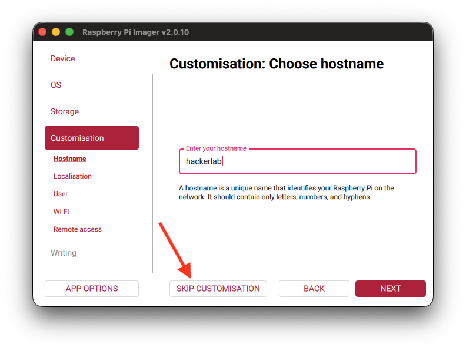

# Kali Linux on Raspberry Pi

## WiFi - Why you are doing it wrong
When flashing Kali linux OS for Raspberry Pi from Pi Imager, most of us choose the standard installation process with customization option which provides us the ability to set the hostname, user management and wifi connection capabilities.

This particular approach will end up creating a conflict with Kali Linux's NetworkManager, and we end up with a os without Wifi Capabilities, but other radio communications like Bluetooth and the physical network connection (Ethernet) will work fine

### Solutions
- Easy way: Just **Skip Customization** and continue with flashing the SD Card / SSD. The default creds **kali:kali** will be applied with the hostname **kali-raspberrypi**

